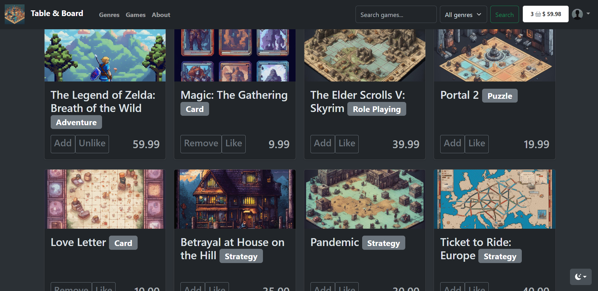

# Table & Board

*Table & Board* is an online store for board games and tabletop games. Users can browse games, add them to their cart or wishlist, and manage their cart and wishlist.



## Features

- Browse games by genre, title, or query
- Add games to cart and wishlist
- Manage cart and wishlist items
- Responsive design for mobile and desktop devices

## Technologies Used

[](https://www.djangoproject.com/)
[](https://www.postgresql.org/)
[](https://www.bootstrap.com/)

- Django: A high-level Python web framework
- PosgreSQL: A lightweight database for storing game data
- HTML, CSS, and JavaScript: For building the frontend of the website
- Bootstrap: A popular CSS framework for building responsive and mobile-first websites
- AJAX: For creating asynchronous web applications

## Setup

1. Clone the repository:

```
git clone https://github.com/samwance/game_store.git
```

2. Change into the project directory:

```
cd game_store
```

3. Install the required packages:

```
pip install -r requirements.txt
```

4. Load the data in the database:
```
python manage.py loaddata db_data.json
```
5. Run the development server:

```
python manage.py runserver
```

Open the website in your browser:
http://localhost:8000

to make a superuser u can use this command:
```
python manage.py csu
```   

